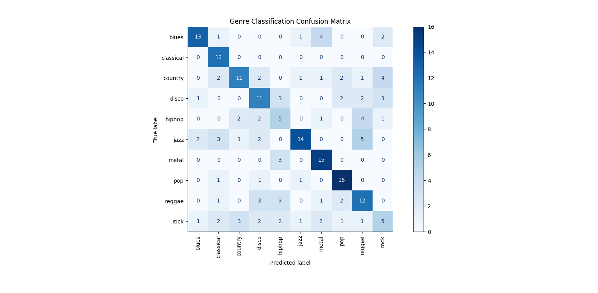

# 🎵 Audio Genre Classifier using MFCCs

An automated machine learning pipeline that extracts frequency-domain features from raw audio signals to classify tracks into 10 musical genres. Developed as part of an academic Signals & Systems (CCA 2) project.

## 🧠 Core Concept
Raw audio waveforms contain too much acoustic noise that is irrelevant to human hearing. This project utilizes **Mel-Frequency Cepstral Coefficients (MFCCs)** to compress audio into mathematical "fingerprints." 

By mapping the signal to the Mel scale (which mimics the non-linear human perception of pitch) and applying a Discrete Cosine Transform (DCT), we extract the spectral envelope of the sound, discarding the noise.

## 🛠️ Tech Stack
* **Python** (Core Logic)
* **Librosa** (Audio Signal Processing & Feature Extraction)
* **Scikit-learn** (Random Forest Classifier & Evaluation Metrics)
* **Pandas & NumPy** (Data Manipulation)
* **Matplotlib** (Data Visualization)

## 📊 Dataset
This project uses the standard **GTZAN Dataset**:
* **1,000 Audio Tracks** (30 seconds each, 22,050 Hz).
* **10 Genres:** Blues, Classical, Country, Disco, Hip-hop, Jazz, Metal, Pop, Reggae, Rock.
* *Note: The raw audio dataset is ignored in this repository due to size constraints, but the extracted mathematical features (`extracted_features.csv`) are provided so the model can be trained directly.*

## 🚀 Execution Pipeline

1. **Feature Extraction:** The `extract_features.py` script frames the audio, applies windowing, computes the FFT, and maps it through Mel filter banks to extract 13 MFCC coefficients per track.
2. **Model Training:** The `train_model.py` script feeds the MFCC features into a Random Forest Classifier (80/20 train-test split).

## 📈 Results & Analysis
The model achieved strong overall accuracy, particularly excelling in genres with highly distinct spectral energy.

* **Top Performers:** Pop (80%+ accuracy), Metal, and Classical.
* **Challenges:** The model occasionally confused **Rock** with **Blues** and **Country**. In signal processing terms, this is expected as these genres share similar instrumentation (e.g., distorted electric guitars) and overlapping frequency bands, making their MFCC signatures mathematically similar.

*(Upload your Confusion Matrix screenshot here and name it `confusion_matrix.png` in your repo)*

---
**Developed by:** Sahil Muneer Nowsheri